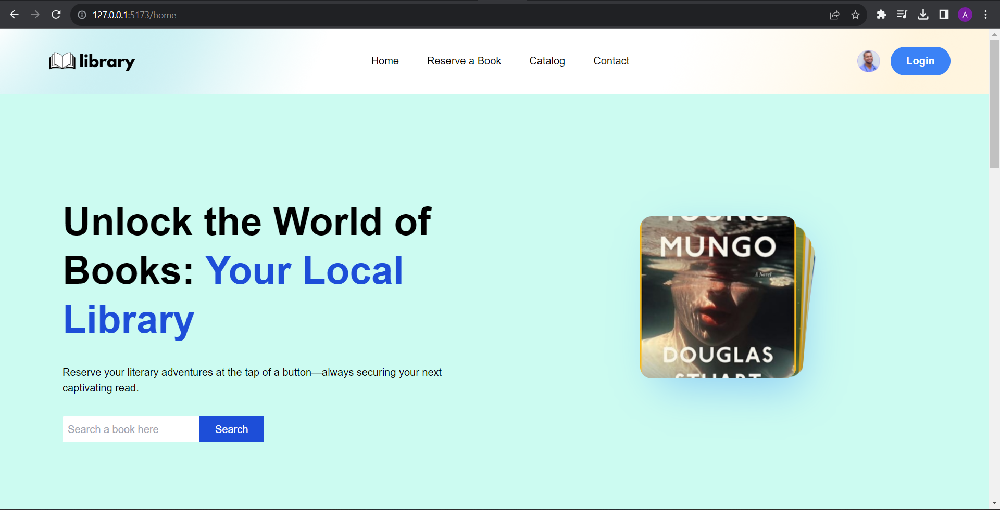
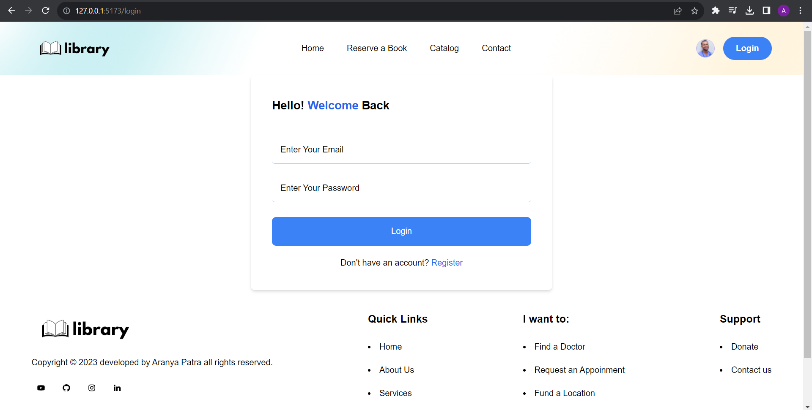

# Local Library Management System







## Overview

This web application serves as a local library management system, enabling users to manage their accounts, browse available books, reserve them, and facilitate administrators in managing books and user accounts. It's built using React for the frontend, Node.js and Express.js for the backend, and MongoDB for data storage.

## Key Features

- **User Authentication**: Users can register, log in, and have roles as either Admin or Member.
- **Book Catalog**: Displays a list of books with details and search/filter capabilities.
- **Book Reservation System**: Allows users to reserve available books, updating book availability accordingly.
- **User Dashboard**: Users can view profiles, reserved books, and reservation history. Admins can manage books and users.
- **Responsive Design**: Implemented using React for a seamless experience across devices.

## Technical Requirements

### Frontend

- Built with React
- Responsive design for cross-device compatibility
- Utilizes Tailwind CSS for styling

### Backend

- Developed using Node.js and Express.js
- RESTful services for interaction with frontend

### Database

- MongoDB used for data storage
- Schemas for books and users designed appropriately

### Additional Considerations

- Error handling and data validation implemented
- Unit tests written for critical functionalities
- Security measures taken against common web vulnerabilities
- API endpoints documented for reference

## Setup Instructions

### Prerequisites

- Node.js installed
- MongoDB installed and running

### Steps

1. Clone the repository:

   ```bash
   git clone https://github.com/your-username/local-library-management-system.git

